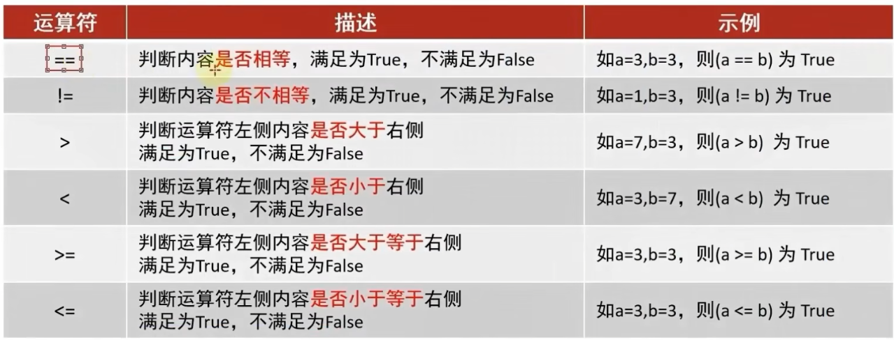
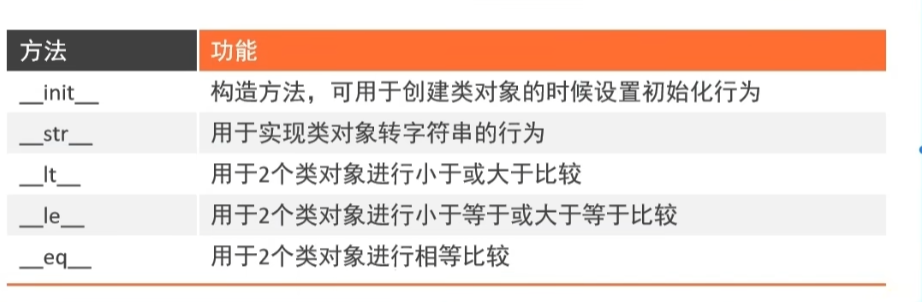
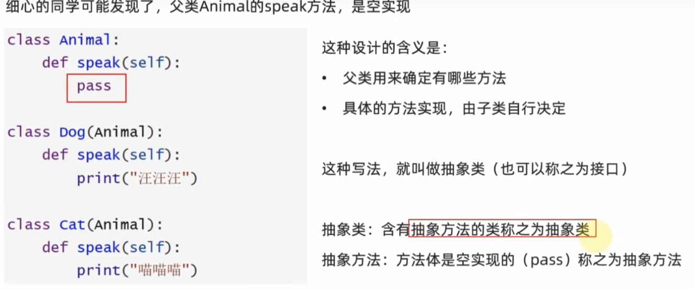

# Python

###### 常用的数值类型


---

###### 注释

```python
# 单行注释
""""多行注释
多行注释"""
```

###### 变量

格式:变量名=变量值

###### 数据类型

```Python
# 方式一:  使用Python直接输出
print(type("黑马程序员"))
# 方式二:  使用变量存储type()语句的结果
string_type=type("黑马")
int_type=type(23213)
float_type=type(232.13)
print(string_type)
print(int_type)
print(float_type)
# 方式三:
s="黑马"
s_type=type(s)
```

---

###### 数据类型转换


```python
# 将数字类型转换为字符串
num_str=str(123)
print(type(num_str),num_str)
# 将字符串转换成数字
str_num=int("1515")
print(type(str_num),str_num)
# 将浮点数转换成整数
float_int=int(12.5)
print(type(float_int),float_int)
```

---

###### 标识符

标识符命名中，只允许出现：

- 英文
- 数字
- 下划线

这四类元素

1. <font color='red'>不推荐</font>使用中文
2. 数字<font color='red'>不可以</font>开头

其余任何内容都不被允许

<font color='red'>变量名的规范</font>

- 见名知意
- 驼山命名法
- 英文字母全小写

---

######  运算符

---


```python
# 算术（数学）运算符
print("1+1=",1+1)
print("2-1=",2-1)
print("3*3=",3*3)
print("4/2=",4/2)
print("11/2=",11/2)
print("9%2=",9%2)
print("2**2=",2**2)
# 井赋值运算符
```

###### 复合运算符


```python
# 算术（数学）运算符
print("1+1=",1+1)
print("2-1=",2-1)
print("3*3=",3*3)
print("4/2=",4/2)
print("11/2=",11/2)
print("9%2=",9%2)
print("2**2=",2**2)
# 井赋值运算符
num =1+2*3
# 复合运算符
num=1
num+=1 # num=num+1
print("num+=1:",num)
num-=1 #num=num-1
print("num-=1:",num)
num *=4
print("num *=4:",num)
num /=2
print("num /=2:",num)
num=3
num %=2
print("num %=2:",num)
num **=2
print("num **=2:",num)
num=9
num//=2
print("num //=2:",num)
```

###### 字符串拼接用+号

###### 字符串格式化

---


###### 字符串格式化-数字精度控制

%d.m

###### 字符串格式化-快速写法

```python
# 语法格式
f"内容{变量}"
---
# 用法
name="传播智客"
stoc_year=2006
stoc_price=19.99
print(f"我是{name}我成立于:{stoc_year}我今天的股票价格为{stoc_price}")

```

###### <font color='red'>字符串格式化-表达式格式化</font>

表达式:一条具有<font color='red'>明确执行结果</font>的代码语句

```Python
print("1*1的结果是:%d"%(1*1))
print(f"1*2的结果是{1*2}")
print(f"字符串在Python中的类型名是:%s"%type("字符串"))
```


<font color='orange'>课后小作业</font>


```python
# 公司名
name = "传播智客"
# 当前股价
stock_price = 19.99
# 股票代码
stock_code = "003032"
# 股票每日增长系数 浮点数类型
stock_price_daily = 1.3
# 增长天数
growth_days = 12
# 计算增长x天以后的股价
growth_rate = stock_price * stock_price_daily ** growth_days
# 进行输出
print(f"公司:{name},股票代码:{stock_code},当前股价:{stock_price}")
print("每日增长系数是:%.1f,经过%d天的增长后,股价达到了:%.2f" % (stock_price_daily, growth_days, growth_rate))

```

###### 数据输入

<font color='red'>input</font>

```python
name=input("请告诉我你是谁")
print("获取到了,你是:%s" %name)
# 输入数字类型
num = int(input("请告诉我你的银行卡密码"))
print("你的银行卡密码类型是:%s"%(type(num)) )
```

###### 判断逻辑

###### 比较运算符



###### if语句的基本格式

```python
# 语法
if 要判断的条件:
     条件成立,要做的事情
else:
        不满足要做的事情
```

```python
print("欢迎来到黑马游乐场,儿童免费成人收费")
age=int(input("请输入你的年龄:"))
if age>=18:
    print("你已成年,游玩需要补充10元")
else:
    print("你是儿童免费游玩")
print("祝你游戏愉快")
```

###### if elif else

```python
if 条件1:
	条件1满足做的事情
elif 条件2:
    条件2满足做的事情
else:
    条件都不满足做的事情
```

###### 判断语句的嵌套

```python
if 条件1:
    满足条件1,做1的事情
    if 条件2:
        满足条件2做的事情
```

###### while循环的语句

```
while 条件:
	条件满足,做
```

###### while循环嵌套

```
while 条件:
	执行
	while 条件:
	执行
```


###### print<font color='red'>不换行功能</font>

在语句中加入end=‘’

```python
print("helloword",end='')
```

制表符\t

###### for循环	<font color='red'>遍历循环</font>

```python
for 临时变量 in 待处理数据集:
	循环满足条件式执行的代码
```

```python
# 定义一个字符串变量nemae 判断name里面有几个a
name = "itheima is a brand of itcast"
# 定义次数
count = 0
for x in name:
    temp = x
    if temp == "a":
        count += 1
print(count)

```

###### range语句


```
语法1:
	range(num)取012345但是不包含num
	比如range(3)取012
语法2:
	range(num1,num2)5-10单不包含num2
	range(5,8)取567
语法3:
	range(num1,num2,step)不包含num2 数字之间隔step的数据
	range(4,12,2) 46810
```

###### for和while的相互嵌套

######  循环中断	<font color='red'>countinue 和break</font>

countinue是跳过(临时中断)

break是跳出(永久中断)

##### 函数

函数:是<font color='red'>组织好的,可重复使用</font>的,用来实现特定的<font color='red'>代码段</font>

```python
def 函数名(传入参数):
	函数体
	return 返回值
```

<font color='red'>函数的调用</font>  	<font color='orange'>函数名(参数)</font>


###### 函数的返回值 return

###### 函数返回值none类型


在if判断语句中 none等同于Falsse

None用于声明无初始内容的变量


###### 函数对的说明文档

```
def 函数名(参数):
	``` ```
```

###### 函数的嵌套调用

###### 函数的变量作用域

global关键字声明变量,可将局部变量声明成全局变量

格式 global 变量名


###### 使用函数来完成银行系统


##### 数据容器

###### 数据容器:list(列表)

列表的方法

index(查询方法)

```
语法:列表.index(元素)
```

修改特定位置(索引)的元素值

```
语法:列表[下标]=值
```

插入元素

```
语法:列表.insert(下标,元素),在指定下标位置,插入指定的元素
```

追加元素

```
语法:列表.append(元素),将指定元素,追加到列表的尾部
```

追加一批元素

```
语法:列表.exxtend(其他容器的数据),将其他数据容器的内容取出,一次追加到列表尾部
```

删除元素

```
语法1:del列表[下标]
语法2:列表.pop(下标)
```

删除某元素在列表中的第一个匹配选项

```
语法:列表.remove(元素)
```

清空列表

```
语法:列表.clear()
```

统计某个元素在列表内的数量

```
语法:列表.count(元素)
```

统计列表有多少元素

```
语法:len(列表)
```

---

练习

###### list(列表)的遍历

```python
#字面量
[元素1,元素2,元素3.....]
#定义变量
变量名称 =[元素1,元素2,元素3.....]
#定义空列表
变量名称 =[]
变量名称 = list()
###while循环遍历
# coun=0  
 while coun<len(my_list):  
     print(my_list[coun])  
     coun+=1

for 临时变量 in 数据容器:
	print(临时变量)
```


---
<font color='red'>练习</font>


###### 数据容器:tuple(元组)(只能查询,不能修改)

```
变量名称=(元素,元素2,元素3,....)
定义空元祖
变量名称=()
```

元组添加append

```
data_list.append([province_name, province_confirm])
```

元组的练习


```
```


###### 数据容器:str(字符串)

查找

```
字符串.index(元素)
```

字符串的替换

```
语法:字符串.replace(字符串1,字符串2)
功能:将字符串内的全部;字符串1,替换成字符串2
得到一个新的字符串
```

字符串的分割

```
语法:字符串.split(分割字符串)
功能:按照指定的分割字符串,将字符串分为多个字符串,并存入列表对象中
注意:字符串本身不变,而是得到了一个列表对象

```

字符串的规整操作(去见后空格)

```
语法:字符串.strip()
```

字符串的规整操作(去前后指定的字符串)

```
语法:字符串.strip(字符串)
```

字符串的翻转(反转)

```
字符串名称[::-1]
```


###### 数据容器的切片

序列的切片

```
语法:序列[其实下标:结束下标:步长]
```


###### 数据容器:set(集合)

---

```
语法:变量名 ={元素1,元素2......}
变量名= set()
#添加新元素
变量名.add()
#移除元素
集合.remove(元素)
#随机取出一个元素
语法:集合.pop()
#清空集合
集合.cler()
#取出2个集合的差集
语法:集合1.difference(集合2)  ###功能取出集合1和集合2 的差集(集合1有但集合2没有)
# 消除两个集合的差集
语法:集合1.difference_update(集合2) ###对比集合1和集合2,在集合1内删除和集合2相同的元素
#2个集合合并
语法:集合1.unior(集合2)##将集合1和集合2 组成新集合
#集合遍历只能用 for循环
```


###### 数据容器:dict(字典,映射)

```
定义字典变量
字典名={key:value,key2:value}
定义空字典
字典名={}
字典名=dict()
#新增元素
语法:字典[key]=value
#更新元素
语法:字典[key]=value
#删除元素
语法:字典.pop(key)
#清空元素
语法:字典.clear
#获取全部key
语法:字典.keys()
 
```

```
字典的遍历
方式1:通过获取到全部的key来完成遍历
方式二:直接对字典for循环
```


###### 数据容器的通用操作

- 除了集合和字典不能使用while循环遍历,其他的都支持for和while遍历

- len(容器)长度  最大长度max(容器) 最小长度min(容器)

- 容器的转换 list(容器)转换为列表  str(容器)转换为字符串 tuple(容器)转换为元祖 set(容器)转换为集合

- ----

  

容器的<font color='red'>通用排序</font>###结果会变成<font color='cornflowerblue'>列表</font>

```
sorted(容器,[revers=True])  ######revers=True翻转也就是从大到小
```


数据容器分类


数据的使用场景

- 列表:一批数据,可修改,可重复的存储场景
- 元祖:一批数据,不可修改,可重复的存储场景
- 字符串:一串字符串的存储场景
- 集合:一批数据,可用key检索value的存储场景


###### 综合案例


#### 函数的进阶操作

###### 多个返回值

```
def 函数名():
	return 1,2
接受的话
x,y= 函数名 ###结果x=1,y=2
```

##### 函数的多种传参方式

###### 位置参数(传递的参数和定义的参数的顺序几个数必须一致)

```python
def 函数名 (a,b,c):
    print(f"你的名字是{a},年龄是{b},性别是{c}")
    你的名字是a,年龄是b,性别是c
```

###### 关键字参数:函数调用时通过“键=值”形式传递参数 	(消除了参数的顺序需求)

```
def 函数名 (a,b,c):
    print(f"你的名字是{a},年龄是{b},性别是{c}")
函数名(a="小王",b=18,c="男")    
    你的名字是小王,年龄是18,性别是男
```

######  缺省参数:当调用函数时没有传递参数,就会使用默认是用缺省参数对应的值 

```
def 函数名 (a,b,c=男):
    print(f"你的名字是{a},年龄是{b},性别是{c}")
函数名(a="小王",b=18)    
    你的名字是小王,年龄是18,性别是男
```

###### 不定长参数 :当调用函数时不确定参数个数时,可以使用不定长参数

###### 位置传递不定长参数

传进的所有参数都会被args变量收集,合并为一元祖(tuple),args是元祖类型

```
def 函数名 (*args):
    print(f"你的名字是{a},年龄是{b},性别是{c}")
函数名(a="小王",b=18,c="男")    
    你的名字是小王,年龄是18,性别是男
```

###### 关键字传递不定长参数

参数是“键=值”形式的形式的情况下,所有的“键=值”都会被kwargs接受,同时会根据“键盘

=值”组成字典

```
def 函数名 (**kwargs):
    print(f"你的名字是{a},年龄是{b},性别是{c}")
函数名(a="小王",b=18,c="男")    
    你的名字是小王,年龄是18,性别是男
```

###### 函数作为参数传递(计算逻辑的传递,而非数据的传递)

<font color='red'>lambda匿名函数</font>(只能使用一次)

```
语法:
lambda 传入参数:函数体(一行代码)
```

```
def test(comput):
	result = comput(1,2)
	print(result)
test(lambda x,y:x+y)	
```

##### python中文件操作

###### python中文件的读取

open()<font color='red'>打开函数</font>

```
语法
open(name,mode,encoding)
name:是要打开的目标文件或者字符串(可以包含文件所在的具体路径)
mode:设置打开文件的模式(访问模式):只读r,写入w,追加a等
encoding:编码格式

f=opne('python.txt','r','encoding=UTF-8')
```

read()方法

```
文件对象.read(num)
num表示要从文件读取的数据长度(单位是字节),如果没有传入num,那么就读取文件中的所有数据
```

readlines()方法

```
文件对象.readline()把整个文件中的内容进行一次性读取,并且返回一个列表,其中每一行的数据为一个元素
文件对象.close ###关闭对象
```

程序延迟方法

```
语法:
使用前先导包
import time
time.sleep(秒)
```

with open 语法(自动关闭文件)

```
with open("python.txt","r",encoding='utf-8')as f:
	f.readlines
	
with open("C:/Users/w2071/Desktop/激活码.txt","r",encoding='utf-8')as f:
    for line in f:
        print(line)	
```

|   <font color='red'>操作</font>   |                  功能                  |
| :-------------------------------: | :------------------------------------: |
| 文件对象=open(file,mode,encoding) |          打开文件获得文件对象          |
|        文件对象.read(num)         | 读取指定长度字节 不指定num读取文件全部 |
|        文件对象.readline()        |                读取一行                |
|       for line in 文件对象        |   for循环文件行 一次循环得到一行数据   |
|         文件对象.close()          |              关闭文件对象              |
|         with open() as f:         | 通过with open语句打开文件 可以自动关闭 |

文件关闭.clos(内置flush刷新)

###### 文件的写出操作(w模式)

当文件已存在使用w,<font color='red'>会清空</font>文件里面的数据

---


```
#1.打开文件
f =open('python.txt',"w")
#2.写入文件
f.write(helloword")
```

内容刷新(flush)

```
文件.flush()
```

##### 文件的写出操作(a模式)

```
a模式是追加不清空
```

#### python中的bug


###### 捕获异常

```
基本语法
try:
	可能发生错误的代码
except:
	如果出现异常执行的代码
```

###### 捕获指定异常

```
try:
	print(name)
except NameError as e:
	print("name变量名称未定义错误")
```

捕获多个异常

```
try:
	print(1/0)
except (NameError,ZeroDivisionError):
	print("ZeroDivisionError错误")
```

###### 捕获所有异常

```
try:
	可能发生的代码
except Exception as e:	
```

异常else

```
try:
	可能发生的代码
except Exception as e:	
else:
	print("很好没有发现异常")
```

###### 异常的finally

finally表示是无论是否异常都要执行的代码

```
try:
	f=open("text","r")
except Exception as e:
	f=open("text","w")
else:
	print("没有bug'")
finally:
	f.close()
```


###### 使用except:或者exceptException捕获所有异常

##### python模块的导入

```
语法
[from 模块名] import [模块|类|变量名|函数|*][as 别名]
```

常见在组合

- import 模块名
- form 模块名 import 类,变量,方法等
- form 模块名 import *
- import 模块名 as 别名
- form 模块名 impor 功能名 as 别名

###### import

```
基本语法
import 模块名
import 模块名1,模块名2
模块名.功能名()
```

自定义的包当导入时会自动执行

但是这样导就不会自动执行了

```
if __name__ == '__main__':
	执行语句
	
```

“__  all __”变量


---

#### python中第三方包

安装第三方包指令-pip

```cmd
语法
pip install 包名称
```

pip网络优化

```
pip install -i https://pypi.tuna.tsinghjua.edu.cn/simple 包的名称
```


##### 科学计算常用的包:numpy包

##### 数据分析中常用的:pandas包

##### 大数据计算中的:pyspark,apache-flink包

##### 图形可视化常用的:matplotlib, pyecharts

##### 人工智能常用的:tensorflow

##### 

###### json数据格式

python数据和JSON数据的相互转化

```python
#导入json模块
import json

#准备好的复合格式的json格式要求的python数据
data=[{"name":"航","age":"18"},{"name":"小航","age":"16"}]
#通过json.dumps(data)方法把python中的数据转化为json数据
data=json.dumps(data)
#通过json.loads(data)方法把json数据转化为python数据
data=json.loads(data)
```


```
dumps语法
ensure_ascii=False转化为中文
```

json.loads(将字符串转为列表或者字典)


 

#####  pyecharts第三包案列 数据可视化

###### 基础折线图

```python
# 导包,导入line功能构件图对象
from pyecharts.charts import Line
#得到折线图对象
line =Line()
#添加x轴数据
line.add_xaxis(["中国","美国","英国"])
#添加y轴数据
line.add_yaxis("GDP",[30,20,10])
#生成图标
line.render()
```

###### set_global_opts方法

```python
#pos_left 这个是控制标题距离右边多远,center居中
##pos_bottom 距离底部多远
from pyecharts.options import TitleOpts
line.set_global_opts(
    title_opts=TitleOpts(title="GDP展示",pos_left=)
)
```

###### map(地图)

视觉映射器


#### 动态柱状图的开发

###### 基础的柱状图


###### xy轴反转

```
对象.reversal_axis()
```

在y轴输入

```
label_opts=LabelOpts(
    position="right"
    作用可以让数值跑到右边
```


###### 基础时间线

```
from pyecharts.charts import Bar, Timeline
timelin=Timeline()
timeline.add(柱状图,"名字")
```


```python
#设置自动播放
timeline.add_schema(
    play_interval=1000,     #自动播放的时间间隔
    is_timeline_show=True,  #自动播放的时候,是否显示时间线
    is_auto_play=True,      #是否自动播放
    is_loop_play=True,      #是否循环自动播放
    
)
```

时间线设置主题

```python
#创建时间线对象
timeline=Timeline(
    {
        "theme": ThemeType.light,
    }
)
```

主题

###### 

###### GDP动态图标的绘制

##### sort方法排序

```
列表.short(key=选择排序依据的函数,reverse=True|Fasle)
参数key:是要求传入一个参数,表示列表的每一个元素都传入函数中,返回排序的依据
参数reverse,是否反转排序的结果,True表示降序,False表示升序
```

匿名函数

```
语法:
lambda 传入参数:函数体(一行代码)
```


科学计数法通过float可以转换为数字(float函数无视换行符)

#### 第二阶段

###### 类的定义和使用

```python
class 类名称:		class是关键字
    类的属性	类的属性,及定义在类中的变量(成员变量)
    类的行为	类的行为,及定义在类中的函数(成员方法)
```

###### 创建类对象的语法:

```
对象=类名称()
```

```python
class student:
    name=None
    age=None
    
    def say_hi(self):
        print(f"hi,大家伙我是{self.name}")
```

###### 成员方法中的定义语法

```python
def 方法名(self,形参1,形参2):
	方法体

#self是关键字是成员方法定义的时候,必须填写的
#它用来表示类对象自身的意思
#当我们使用类对象调用方法的是,self会自动被python传入
#在方法内部,想要访问类的成员变量,必须使用self
```

###### 构造方法使用__int__()构造方法


##### 魔术方法

```python
# 构造方法
__init__
# 字符串方法
__str__
# 小于大于符号比较
__lt__
# 小于等于大于等于比较
__le__
# ==符号比较
__eq__


```

###### __str__魔术字符串的使用

```
方法名:__srt__
返回值:字符串
内容:自行定义
```

__lt__小于大于符号比较

```
方法名:__lt__
传入参数:other,另一个类对象
返回值:True或者Flase
内容:自行定义
```



##### 封装

理解为:基于模板(类)取创建实体(对象),使用对象完成开发

面向对象包含三大主要特性

- 封装
- 继承
- 多态

###### 私有成员

- 私有成员变量:变量名以__开头(两个下划线)
- 私有成员方法:方法名以__开头(两个下划线)

##### 继承

###### 继承基础语法

```python
#单继承:语法
class 类名(父类名):
    类内容体
#多继承:语法  	(从左往右)
class 类名(父类1,父类2,....父类n)
	类内容体
```

###### pass(补全语法,也可以表示为空)

###### 复写和使用父类成员

###### 调用父类同名成员

```python
#方式一:
调用父类成员
使用成员变量:父类名.成员变量
使用成员方法:父类名.成员方法(self)

#方式二:
使用super()调用父类
使用成员变量:super().成员变量
使用成员方法:super().成员方法()
```


##### 类型注解  	

支持:

- 变量的类型注释

- 函数(方法)形参列表和返回值的类型注释

  基础语法: 变量:类型

  类对象语法:  类型:类 =类()

```
number :int =8566
```

基础容器类型注释

```python
my_list :list =[1,2,3]
my_tuple :tuple =(1,2,3)
my_set :set ={1,2,3}
my_dict: dict ={"itheima":666}
my_str: str ="itheima "
```

容器类型详细注释

```python
my_list :list[int] =[1,2,3]
my_tuple: tuple[str,int,bool]=("itheima",66,True)
my_set : set[int] ={1,2,3}
my_dict : dict[str,int]={"itheima":6366}
```

函数和方法注解

union类型

import union

union[类型.类型]

  

#### 多态

同样的行为(函数),传入不同的对象,得到不同的状态



抽象类:含有抽象方法的类称为抽象类

抽象方法:含pass


#### mysql

库>表>数据

show databases; 查看有哪些数据库

use 数据库名	使用某个数据库

show tables 查看数据库内有那些表

exit 	退出MYSQL的命令环境

- 数据定义:DDL
- 数据操纵:DML
- 数据控制:DCL
- 数据查询:DQL

大小写不敏感

都是用过;来结尾

单行注释# #后面要有空格

##### 数据定义DDL

```mysql
#查看数据库
show databases;
#使用数据库
use 数据库名称;
#创建数据库
create database 数据库名称 [charset,utf8];
#删除数据库
drop database 数据库名称;
#查看当前使用的数据库
select database();
#查看有哪些表
show tables:
#创建表
#列表类型有
int		--类型
float	--浮点数
varchar(长度)	 --文本,长度为数字,(255)
date	--日期类型
timestamap	--时间戳类型
create table 表名称(
    列名称 列类型,
    列名称 列类型
);
#删除表
drop table 表名称;
drop table if exists 表名称;
```

##### dml

插入 insert

```
insert inio 表[(列1,列2....)] values(值1,值2....)[,(值1侄儿)]
```


删除delete

```
delete from 表名称 where 条件判断
```


更新update

```
update 表名 set 列 = 值 where 条件判断
```

##### dql 

数据库查询

```
select 字段列表|from 表
```

分组聚合

```
select 字段|聚合函数 from 表 where[条件]  group by 列

###聚合函数有
sum(列)求和
avg(列)求平均值
min(列)求最新值
max(列)求最大值
count(列|*)求数量
```

 结果排序

```mysql
order by ... [asc |desc]  asc 从小到大  desc  从大到小
```

结果分写排序

```
limit n,m  n代表限制几个     n,m 是从低n个开始 取m个
```

##### pymysql

```python
from pymysql import Connection
conn =Connection(
    host='localhost',   #主机ip
    port=3306,  #端口默认3306
    user='root',
    password='root',
    autocomit=true #自动确认提交
)
#获取游标对象
cursor=conn.cursor()
#选择数据库对象
conn.select_db('test')
# 使用游标对象,执行sql语句
cursor.execute("select * from student")
results:tuple=cursor.fetchall()
for r in results:
    print(r)
#d打印mysql数据库软件信息
```


cnn.comit()

确认更改

连接mysql

```
# 1. 连接 MySQL 数据库
conn = pymysql.connect(
    host="localhost",
    port=3306,
    user="root",
    password="root",
    database="py_Sql",
    autocommit=True
)
```

### pyspark

想要使用pyspark完成数据处理,首先需要构建一个执行环境入口对象.

pyspark的执行环境入口对象是:类SparkContext

```python
#创建SparkConf类对象
conf = SparkConf().setMaster("local[*]").setAppName("test_Spark_app")
```

## 1.数据计算方法

pyspark计算都是基于rdd对象来进行的


## #map算子

对逐个进行算

```
#导包
from pyspark import SparkConf,SparkContext
#创建环境
import os
os.environ["PYSPARK_PYTHON"]="C:/Users/w2071/AppData/Local/Programs/Python/Python310/python.exe"
connf=SparkConf().setMaster("local[*]").setAppName("test_spark")
sc=SparkContext(conf=connf)
#准备一个rdd
rdd =sc.parallelize([1,2,3,4,5,6,7,8,9])
#通过map方法将全部数据都乘以10
def func(data):

    return data* 10
rdd2=rdd.map(func)
print(rdd2.collect())
```

map算子(成员方法)

接受一个处理函数,可以用lambda表达式快速编写

对于rdd内元素逐个处理,并返回一个新的rdd

2.链式调用

对于返回值是新的rdd的算子,可以通过链式调用的方式多次调用算子

#### flatmap算子

功能:对rdd执行map操作,然后进行 解除嵌套操作


啊
